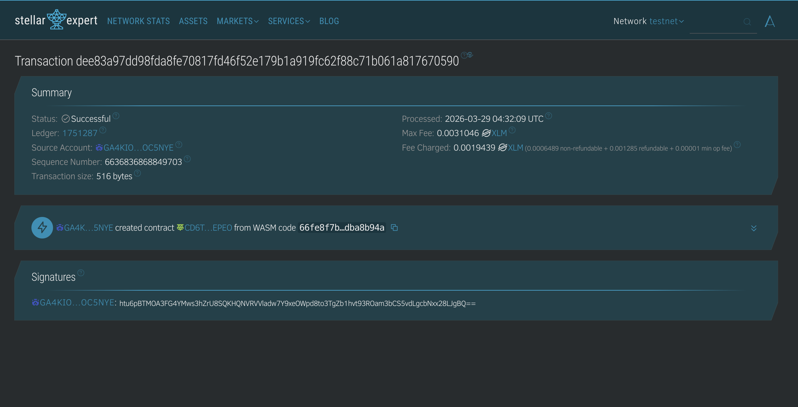

# 👻 Ghost Notes DApp 👻

**A Stellar Soroban Smart Contract where secrets never stay the same.**

---

### 📝 Project Description

**Ghost Notes** is a unique decentralized application built on the Stellar network. Unlike traditional note-taking apps, Ghost Notes stores information that is alive. Every time a note is viewed, the smart contract automatically mutates its content, creating a "ghostly" trail that discourages prying eyes and ensures that what you see once, you may never see again.

### 🌟 Project Vision

We believe in a digital world where data is not just static, but dynamic and sovereign. Our vision is to provide a platform for:

- **Episodic Secrecy**: Creating data that reacts to interaction.
- **Privacy through Mutation**: Protecting content by changing it upon unauthorized or repeated viewing.
- **On-Chain Dynamism**: Demonstrating the power of Soroban's state-changing capabilities in real-time.

---

### 🚀 Key Features

| Feature              | Description                                                                 |
| :------------------- | :-------------------------------------------------------------------------- |
| **Dynamic Mutation** | Content changes automatically based on the number of views (`visit_count`). |
| **Secure Storage**   | Powered by Stellar's Soroban instance storage for permanent availability.   |
| **Privacy First**    | Traditional static data is replaced with evolving narratives.               |
| **Lightweight**      | Optimized Rust implementation for low-cost transactions.                    |

---

### 🔗 Deployed Smartcontract Details

> [!IMPORTANT]
> **Contract ID:** `CD6TZ5S7U4KAHX54XGOLIGO53AYH63TLAS43CDAONM4BCWSFGJTGEPEO`

#### Registry Screenshot

---

### 🔮 Future Scope

- **[ ] Timed Decay**: Notes that completely vanish after a certain duration.
- **[ ] Encryption Layers**: Integration with user-side keys for multi-layered security.
- **[ ] Ghostly Notifications**: Off-chain alerts when your "ghost" has been disturbed.
- **[ ] DAO Governance**: Community control over mutation logic and patterns.

---

  <i>"What is seen cannot be unseen, but it can be changed."</i>

